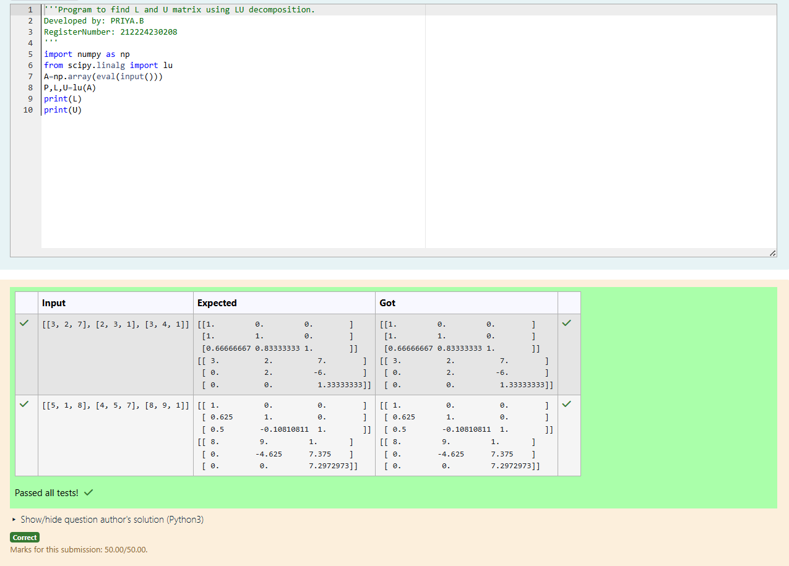
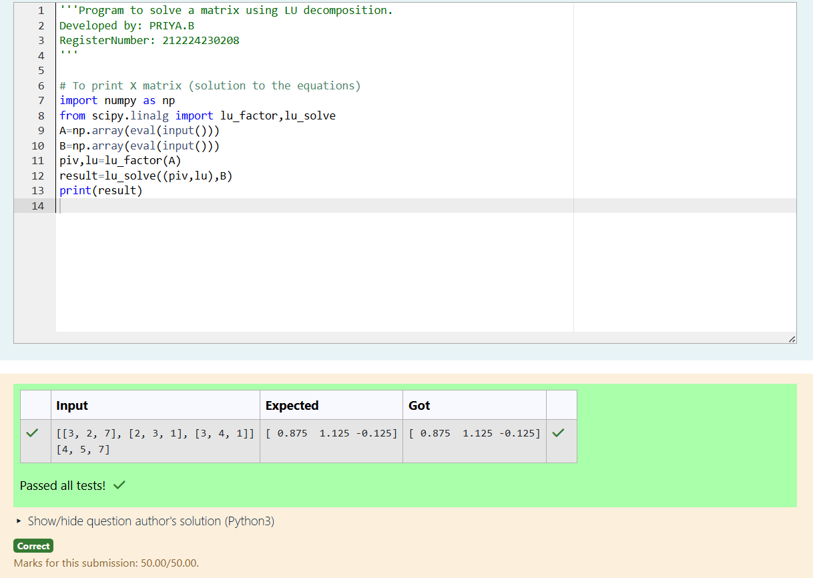

# LU Decomposition 

## AIM:
To write a program to find the LU Decomposition of a matrix.

## Equipments Required:
1. Hardware – PCs
2. Anaconda – Python 3.7 Installation / Moodle-Code Runner

## Algorithm
Step 1:
Import the numpy module to use the built-in functions for calculation

Step 2:
Prepare the lists from each linear equations and assign in np.array()

Step 3:
Using scipy.linalg import lu ,we can find L and U matix.

Step 4:
By using lu_factor ,lu_solve .we can find lu decomposition matrix.

Step 5:
End the program

## Program:
```
(i) To find the L and U matrix
Program to find the L and U matrix.
Developed by: PRIYA.B
RegisterNumber: 212224230208
import numpy as np
from scipy.linalg import lu
A=np.array(eval(input()))
P,L,U=lu(A)
print(L)
print(U)
```

```
(ii) To find the LU Decomposition of a matrix

Program to find the LU Decomposition of a matrix.
Developed by: PRIYA.B
RegisterNumber: 212224230208
import numpy as np
from scipy.linalg import lu_factor,lu_solve
A=np.array(eval(input()))
B=np.array(eval(input()))
piv,lu=lu_factor(A)
result=lu_solve((piv,lu),B)
print(result)
```
## Output:





## Result:
Thus the program to find the LU Decomposition of a matrix is written and verified using python programming.

